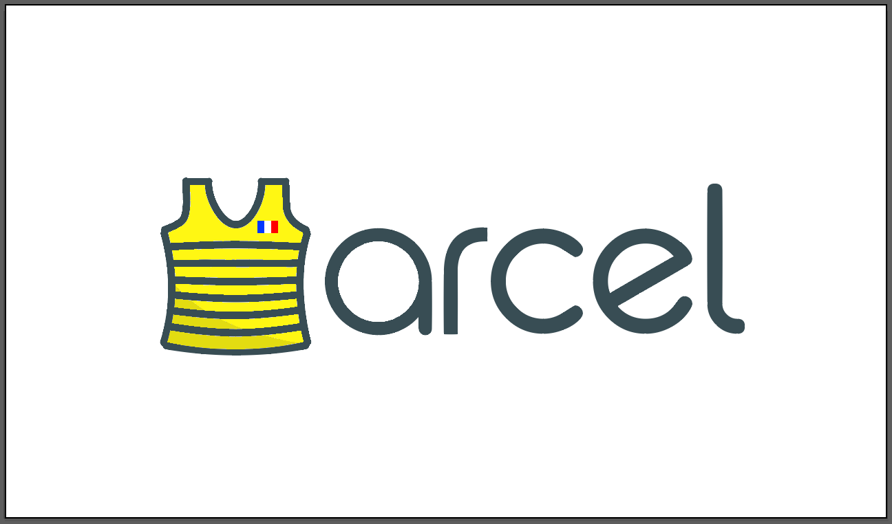

# Marcel, the french Docker - Marcel, le docker français

Marcel is a french wrapper around the docker CLI, intended as a drop-in replacement of docker, for the future french sovereign operating system.

## Examples

* ``docker run`` → ``marcel chauffe``
* ``docker images`` → ``marcel cederoms``
* ``docker login`` → ``marcel vos-papiers``
* ``docker logs`` → ``marcel bûches``
* ``docker pause`` → ``marcel rtt``
* ``docker suspend`` → ``marcel grève``
* ``docker tag`` → ``marcel graffiti``
* ``docker rmi`` → ``marcel rsa``

## Dockerfile

Obviously, the ``Dockerfile`` name is not sovereign enough for us. That's why instead of ``Dockerfile``s, marcel uses ``RecetteAMarcel`` files.
For now, they use the exact same syntax as ``Dockerfile``, but we'll see about that.

For it to work, you just need to include a ``RecetteAMarcel`` file in the current directory where you execute your ``marcel construis`` command, are you're good to go.

## Thanks
The [original idea](https://github.com/docker/docker/issues/19396) came of [@ndeloof](https://github.com/ndeloof)'s mind.
The logo was provided by [Thom-x](https://github.com/Thom-x).
